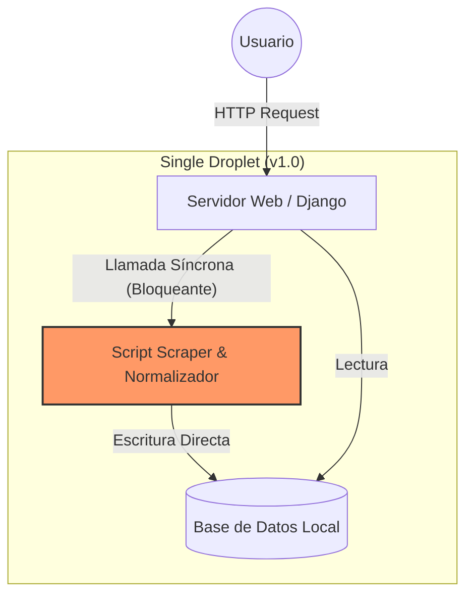
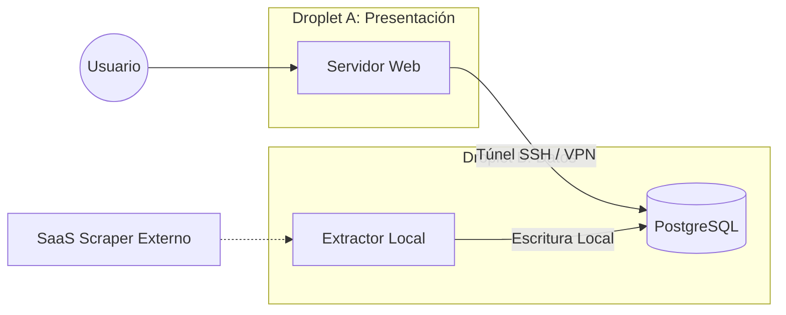
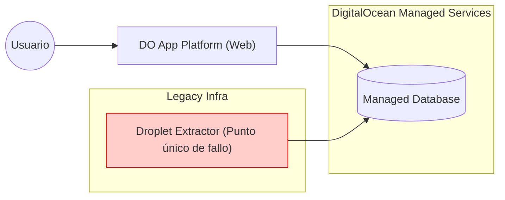
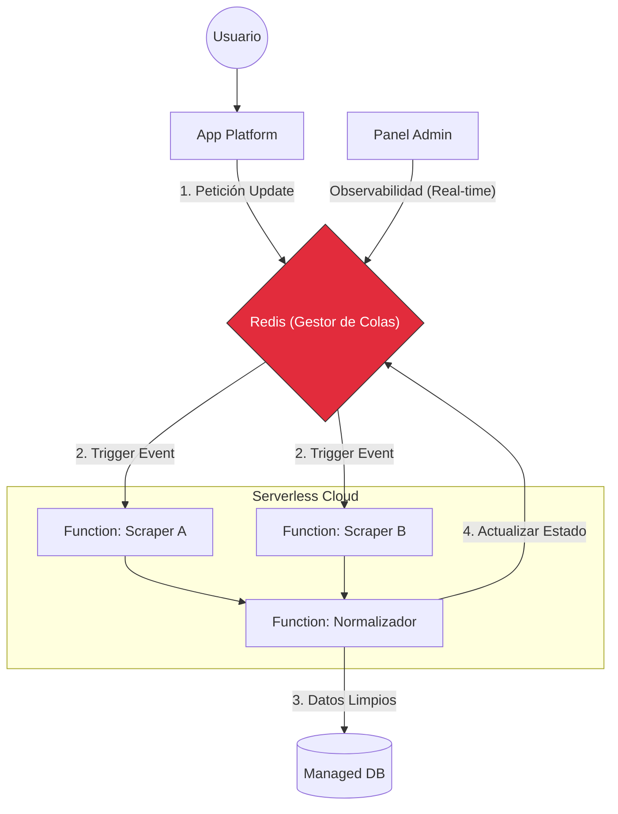
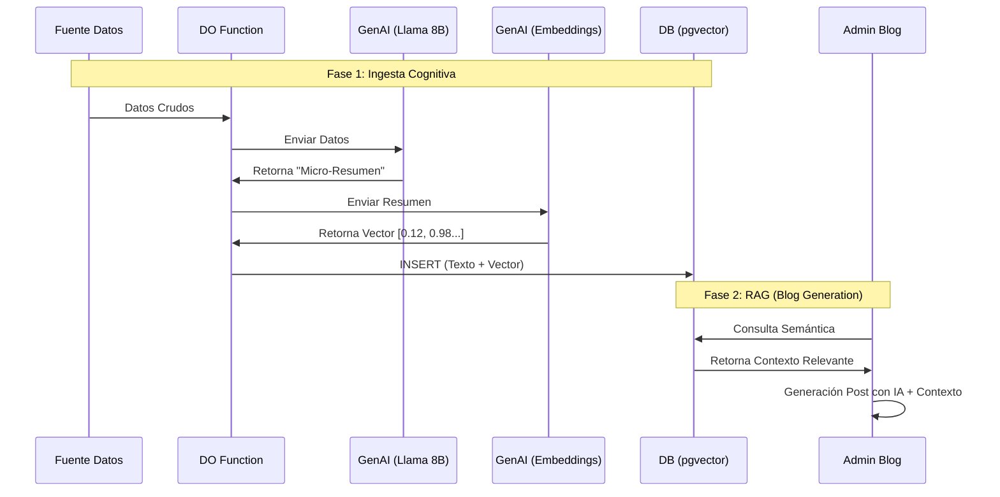

# Arpada Trading System: Arquitectura Serverless y Distribuida

Este proyecto implementa una infraestructura completa para la ingesta, normalización y visualización de datos financieros en tiempo real.

El diseño se centra en la escalabilidad modular y la optimización de costes, utilizando una arquitectura desacoplada basada en **DigitalOcean Functions** y gestión de estado en tiempo real con **Redis**.

## 🔄 Evolución de la Arquitectura

Siguiendo el principio de ingeniería *"MonolithFirst"*, el sistema ha evolucionado desde un prototipo rápido (MVP) hasta una solución distribuida capaz de gestionar alta concurrencia.

### v1.0: El Monolito Unificado (MVP)
**Objetivo:** Prototipado rápido para validar la viabilidad del proyecto y minimizar el tiempo de desarrollo hasta el mercado (*Time-to-Market*).

En la fase inicial, el sistema se diseñó como un prototipo funcional (MVP) bajo una arquitectura monolítica fuertemente acoplada alojada en una única instancia.

* **Ejecución Unificada:** El servidor web gestionaba las peticiones HTTP, ejecutaba los scripts de *scraping*, normalizaba los datos y escribía en base de datos de forma síncrona.
* **Ventajas:** Despliegue simplificado y depuración inmediata, ideal para evaluar la viabilidad técnica y comercial.
* **Problemas detectados:**
    * **Saturación de recursos (Resource Starvation):** Los procesos de *scraping* y normalización generaban picos críticos de CPU y RAM, comprometiendo la estabilidad de toda la instancia.
    * **Cuello de botella en concurrencia:** La contención de recursos impedía atender a múltiples usuarios simultáneamente; la navegación se volvía lenta o inaccesible mientras el servidor procesaba datos en segundo plano.
    * **Escalado ineficiente:** Para solucionar los picos de procesamiento era necesario escalar verticalmente toda la máquina, desperdiciando recursos en los periodos de baja actividad.

### v2.0: Desacoplamiento de Infraestructura y UI Responsiva
**Objetivo:** Mejorar la estabilidad del servicio y la experiencia de usuario (UX) separando la capa de presentación de la persistencia de datos.

En esta etapa de transición, se abandonó el monolito único para dividir la carga en instancias dedicadas (*Droplets* de DigitalOcean).

* **Arquitectura Segregada:**
    * **Web vs. Datos:** Se desplegaron dos instancias independientes: una dedicada exclusivamente al servidor web y la interfaz, y otra para alojar la Base de Datos y el procesamiento pesado.
    * **Conectividad Segura:** La comunicación se estableció mediante **túneles cifrados**, evitando exponer la base de datos a la red pública.
    * **Extractor (Híbrido):** El módulo de *scraping* se desacopló lógicamente, pero se alojó físicamente en la instancia de la base de datos para centralizar la escritura.
* **Ventajas (Estrategia "Keep it Simple"):**
    * **Refactorización Ágil:** Gracias a la base de código consolidada en la v1.0, el desacoplamiento de infraestructura se ejecutó en tiempo récord; solo requirió adaptaciones de conectividad en lugar de reescrituras complejas.
    * **Control de la complejidad:** Se evitó la sobreingeniería prematura, manteniendo una arquitectura fácil de gestionar manualmente sin orquestadores complejos.
    * **Protección de la UX:** Al aislar el servidor Web, los picos de carga del extractor ya no bloqueaban la navegación del usuario.
* **Problemas detectados:**
    * **Inestabilidad del Entorno (Dependency Hell):** Las actualizaciones de librerías y del SO en el servidor de datos generaban conflictos que rompían el entorno de ejecución del extractor local.
    * **Mantenimiento del Scraper:** La fragilidad del código propio frente a cambios en las fuentes externas motivaron la decisión de **delegar la extracción a un servicio SaaS externo** como intermediario fiable.

---

### v3.0: Servicios Gestionados y Modularidad Transparente
**Objetivo:** Eliminar la carga operativa de administración de servidores (DevOps) y aumentar la resiliencia mediante servicios gestionados.

Una vez validada la separación de responsabilidades en la v2.0, se migró la infraestructura a servicios nativos de DigitalOcean (PaaS/DBaaS), eliminando la gestión manual del sistema operativo.

* **Especialización de la Infraestructura:**
    * **Web (App Platform):** El servidor web se migró a un servicio de plataforma gestionada, permitiendo despliegues automáticos y escalado sin gestionar servidores.
    * **Base de Datos (Managed Database):** Se sustituyó el Droplet de datos por un servicio de base de datos gestionado, garantizando copias de seguridad automáticas y alta disponibilidad sin intervención manual.
    * **Extractor (Transición):** Se mantuvo aislado en un Droplet independiente. Se decidió no integrarlo aún en la plataforma gestionada debido a un inminente cambio de paradigma hacia una arquitectura *Serverless* (DigitalOcean Functions).
* **Ventajas (Transparencia y Modularidad):**
    * **Mejora Continua Invisible:** Gracias al desacoplamiento previo, las piezas de la infraestructura pudieron sustituirse (de Droplet a PaaS) de forma totalmente transparente para el usuario final, sin cortes de servicio.
    * **Reducción de "Ruido" Operativo:** El equipo de desarrollo dejó de preocuparse por parches de seguridad, actualizaciones de Linux o configuraciones de firewall en la web y la BBDD.
* **Problema a resolver (Próximo paso):** El Extractor en el Droplet sigue siendo un "punto único de fallo" que requiere mantenimiento y está sobredimensionado para tareas que son esporádicas, lo que prepara el terreno para la **migración a Serverless**.

---

### v4.0: Arquitectura Event-Driven (Serverless & Redis)
**Objetivo:** Escalabilidad infinita, actualización de datos en tiempo real y observabilidad total mediante orquestación de estados de alta velocidad.

En la evolución final, se eliminó el último vestigio de infraestructura fija (el Droplet del "Extractor") para adoptar una arquitectura puramente *Serverless* gestionada por una base de datos en memoria.

* **El nuevo paradigma (Functions):**
    * **Desatomización del Código:** El código del extractor, ya maduro y capaz de gestionar múltiples fuentes, se dividió en micro-funciones independientes (DigitalOcean Functions).
    * **Ejecución Híbrida:** Ya no se limita a ejecuciones programadas (cron); el sistema permite actualizaciones **casi en tiempo real** disparadas por la navegación del usuario (*On-Demand*), mejorando drásticamente la frescura de los datos.
* **El Cerebro: Orquestación con Redis:**
    * **Gestión de Estado:** Se implementó Redis no solo como caché, sino como gestor de colas y estados de alta concurrencia. Cada tarea de extracción/normalización se registra con un estado preciso: *En Espera, Ejecución, Terminada* o *Error* (con su código específico).
    * **Alta Velocidad:** La capacidad de Redis para manejar miles de operaciones por segundo permite coordinar cientos de funciones ejecutándose en paralelo sin que el sistema "sude".
* **Ventajas:**
    * **Observabilidad Total:** El panel de administrador lee directamente de Redis, permitiendo visualizar en tiempo real qué está ocurriendo en el *backend*, detectar errores específicos y reintentar tareas fallidas.
    * **Eficiencia de Costes y Recursos:** Solo se consumen recursos de computación (Functions) cuando hay datos que procesar. Si nadie actualiza, el coste es cero.
    * **Rendimiento "Como un tiro":** Al descargar a la BBDD principal de la gestión de colas y usar la latencia de microsegundos de Redis, la sensación de fluidez del sistema es máxima.

### v5.0: Inteligencia Artificial Nativa (GenAI Platform & Vector Search)
**Objetivo:** Transformar datos cuantitativos en "narrativas" cualitativas utilizando servicios gestionados de IA para reducir la complejidad operativa y los costes de inferencia.

Se sustituye la gestión manual de modelos por la **DigitalOcean GenAI Platform**, integrando la inteligencia artificial directamente en el pipeline *serverless*.

* **Fase 1: Ingesta Cognitiva (Serverless Inference & Embeddings):**
    * **Paso A: Micro-Resúmenes (LLM Ligero):** Las *Functions* envían los datos crudos a un modelo de texto eficiente (ej. *Llama 3 8B*) en la plataforma de DO. Se genera un párrafo explicativo limpio.
    * **Paso B: Vectorización (Embedding Model):** Ese párrafo limpio se envía inmediatamente a un **modelo de Embeddings** de DO. Este servicio transforma el texto en una representación matemática (vector) de alta dimensionalidad.
    * **Paso C: Almacenamiento (Managed PostgreSQL):** Finalmente, se guardan tanto el texto legible como su vector correspondiente en la base de datos usando la extensión **`pgvector`**.

* **Fase 2: Experiencia de Usuario (RAG Gestionado):**
    * **Recuperación Semántica:** Cuando el usuario consulta, su pregunta también se vectoriza (con el mismo modelo del Paso B) y se comparan los vectores en PostgreSQL para encontrar los resúmenes más relevantes por cercanía matemática. Solo disponible para administradores para generación de contenido del blog.
    * **El Analista Virtual:** Se utiliza un modelo fundacional de mayor capacidad (vía GenAI Platform) alimentado con esos resúmenes recuperados (RAG) para dar la respuesta final.

* **Ventajas (Stack Tecnológico Unificado):**
    * **Simplificación Total:** Todo (Web, BBDD, Functions, Modelos de Texto y Embeddings) vive dentro del ecosistema de DigitalOcean.
    * **Escalado Económico:** Usar modelos pequeños para resumir y modelos de embeddings optimizados reduce costes frente a usar modelos gigantes para todo.
    * **Gobernanza del Dato:** Los datos sensibles nunca salen de la infraestructura privada virtual (VPC) de DigitalOcean.

