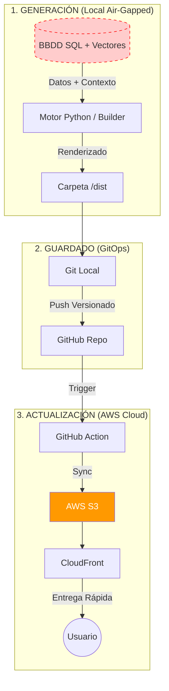

# D2MantiX: Arquitectura de Alto Rendimiento Orientada a SEO

> **Estado:** Producción (Evolución de 20 años)
> **Enfoque:** Rendimiento Extremo (Web Vitals), SEO Holístico y Seguridad "Air-Gapped".

Este proyecto documenta la transformación tecnológica de un portal de contenidos masivo. La arquitectura actual abandona el renderizado dinámico para adoptar un modelo estático de alta velocidad, priorizando la optimización de enlaces internos y la seguridad absoluta.

---

## ⏳ La Evolución Tecnológica

La plataforma ha mutado para sobrevivir y crecer durante dos décadas:
1.  **Era Legacy (PHP/Dinámico):** Servidor expuesto a internet. Problemas de seguridad y cuellos de botella por renderizado en cada visita.
2.  **Era Django:** Mejor estructura de datos, pero el *Time-to-First-Byte* (TTFB) seguía limitado por la CPU del servidor.
3.  **Era Actual (Static & AI):** Eliminación total del servidor web. El sitio se pre-construye localmente para maximizar la velocidad y el SEO.

---

## ⚙️ Workflow Técnico: De Local a la Nube

El corazón del proyecto es un pipeline unidireccional que garantiza que la base de datos nunca toque internet.

### 1. Generación Estática (The Builder)
Todo comienza en un entorno local aislado ("Air-Gapped"). Un motor propio desarrollado en **Python** orquesta la creación del sitio:
* **Sin Renderizado en Cliente:** El script procesa la BBDD y genera HTML puro.
* **Inyección de Scripts:** Se incrustan scripts de terceros (como Google Analytics 4) de forma asíncrona (`defer`) en la plantilla base para no bloquear el renderizado visual.
* **Resultado:** Una réplica exacta del sitio web guardada en una carpeta local `/dist`.

### 2. Guardado y Control de Versiones (Git)
Una vez generada la carpeta `/dist`, el estado del sitio se "congela" y se guarda:
* **Fuente de la Verdad:** Se realiza un *commit* de los archivos HTML generados al repositorio **Git**.
* **Seguridad:** Esto permite auditar qué ha cambiado exactamente en la web antes de publicar y ofrece la capacidad de hacer *rollback* instantáneo a una versión anterior si se detecta un error.

### 3. Actualización y Sincronización (Deploy to S3)
Al hacer *push* al repositorio, se dispara la automatización (CI/CD) que lleva el contenido al usuario:
* **Sincronización Diferencial:** Un pipeline (GitHub Actions) compara los archivos nuevos con los existentes en el bucket de **AWS S3** y sube solo las modificaciones.
* **Distribución Global:** Se invalida selectivamente la caché de **AWS CloudFront** (CDN).
* **Efecto:** El usuario final recibe la nueva versión en milisegundos desde el servidor *Edge* más cercano a su ubicación, sin tocar jamás nuestra infraestructura original.

---

## 🧠 4. Ingeniería de Datos y Generación Inteligente

El sistema no utiliza un generador estático comercial (como Hugo o Next.js), sino un **Motor de Construcción a Medida** integrado sobre el ORM de Django. Esto nos permite manipular los datos a bajo nivel antes de convertirlos en HTML.

### A. Arquitectura de Datos Híbrida (SQL + JSONB + Vectores)
Para gestionar la complejidad de un RPG como Diablo 2, utilizamos un modelo de persistencia políglota en PostgreSQL:

1.  **Datos Estructurados (JSONB):**
    * Los objetos del juego no siguen un esquema fijo (un anillo tiene stats muy distintas a una espada).
    * Utilizamos campos **JSONB** (`Binary JSON`) de PostgreSQL para almacenar los atributos de los ítems.
    * **Ventaja:** Permite realizar consultas complejas ("Busca todas las botas con +Velocidad de Movimiento > 20") a velocidad nativa, sin la rigidez de una tabla relacional tradicional con cientos de columnas vacías.
    
2.  **Datos Semánticos (Vector Store):**
    * **Ingesta:** Un script procesa todo el contenido histórico (noticias, parches, guías antiguas y comentarios de la comunidad).
    * **Embeddings:** Cada fragmento de texto se pasa por un modelo de IA local (Sentence Transformers) para convertirlo en un vector numérico.
    * **Almacenamiento:** Estos vectores se guardan junto al contenido en la base de datos (usando `pgvector`), permitiendo búsquedas por concepto y no solo por palabra clave.

### B. El Motor de Generación (The Builder)
El proceso de construcción utiliza el sistema de plantillas de Django para renderizar el sitio estático (`render_to_string`), pero con capas adicionales de optimización SEO:

1.  **Renderizado Atómico:** El script itera sobre cada objeto y artículo, inyectando los datos en plantillas HTML optimizadas.
2.  **SEO Técnico (Schema.org):**
    * Al generar la página, el motor crea automáticamente el JSON-LD estructurado.
    * Si la página es de un "Ítem", se inyecta el esquema `Item` o `Product` con sus stats exactos.
    * Si es una "Guía", se inyecta `Article` o `HowTo`.
3.  **Mapa del Sitio:** Se genera dinámicamente un `sitemap.xml` jerarquizado y limpio, vital para que Google indexe millones de páginas estáticas correctamente.

### C. Estrategia de Enlazado Bidireccional (AI Link Injection)
Esta es la innovación clave. Cuando se introduce contenido nuevo, el sistema no solo genera la página nueva, sino que **"cura" la hemeroteca existente**:

1.  **Análisis del Nuevo Contenido:**
    * Al crear un artículo nuevo (ej. "Guía de la Hechicera de Fuego"), se genera su vector.
2.  **Búsqueda Inversa (Retro-Linking):**
    * El sistema consulta la BBDD Vectorial: *"¿Qué artículos ANTIGUOS hablan de fuego o hechiceras pero no tienen enlaces actualizados?"*.
3.  **Regeneración Selectiva:**
    * El motor abre esos artículos antiguos (que quizás son de 2015), inyecta un enlace hacia la nueva guía ("Ver actualización 2025: Hechicera de Fuego") y regenera sus HTMLs estáticos.
    
> **Resultado:** Una web viva donde el contenido antiguo nunca muere, sino que gana valor al conectarse automáticamente con las novedades, creando una malla de navegación perfecta para el usuario y para los bots de búsqueda.

---

## 🔄 5. Módulos Pseudo-Dinámicos e Ingesta de Analytics

Uno de los desafíos de las webs estáticas es mostrar contenido variable como "Lo más leído" o sugerencias personalizadas. Resolvemos esto integrando el rendimiento real de los usuarios en el pipeline de construcción.

### A. Ingesta de Datos (El Pulso de la Web)
Semanalmente (o bajo demanda), un script dedicado se conecta a la API de **Google Analytics 4 (GA4)**:
1.  **Extracción:** Descarga métricas clave por URL: *Vistas de página, Tiempo de compromiso y Tasa de rebote*.
2.  **Mapeo:** Cruza estas URLs con los IDs de artículos en nuestra base de datos local PostgreSQL.
3.  **Scoring:** Actualiza un campo `popularity_score` y `engagement_rank` en la tabla de cada artículo.

### B. Actualización de "Noticias Más Visitadas"
Al regenerar el sitio, los módulos laterales (Sidebars) no son estáticos ni aleatorios:
* El generador realiza una consulta SQL ordenando por `popularity_score DESC`.
* Genera el HTML de la lista "Top 10 Semanal" e "Historias Trending".
* **Impacto SEO:** Esto crea enlaces internos potentes hacia el contenido que ya sabemos que funciona, reforzando su posicionamiento.

### C. Artículos Sugeridos (Reranking Vectorial)
Para la sección "Quizás te interese" al final de cada post, usamos un algoritmo de **Búsqueda Híbrida Ponderada**:
1.  **Filtro Semántico:** Primero, la BBDD Vectorial selecciona los 20 artículos más parecidos por contenido (Contexto).
2.  **Reordenamiento por Calidad (Reranking):** Esos 20 candidatos se reordenan multiplicando su similitud por su `engagement_rank` (Datos de Analytics).
3.  **Resultado:** El usuario ve artículos que son **relevantes** (tratan de lo mismo) Y ADEMÁS son **adictivos** (la gente pasa tiempo en ellos).

> **Ciclo Virtuoso:** Al regenerar la web con estos datos actualizados y subirla a S3, el sitio "evoluciona" solo, promocionando automáticamente su mejor contenido sin intervención humana.

---

## ✍️ 6. Pipeline de Producción de Contenido (AI-Assisted)

Para mantener actualizado un portal con miles de páginas sin un equipo editorial masivo, hemos desarrollado un flujo de trabajo **"Human-in-the-Loop"**. No generamos contenido spam automático; utilizamos la IA como un analista de datos que prepara borradores de alta precisión técnica.

### A. El Asistente de Redacción (CLI Tool)
El administrador interactúa con el sistema a través de una herramienta de línea de comandos (CLI) personalizada en Python, no un CMS visual.

**Ejemplo de Flujo:**
`python manage.py draft_guide --topic "Runeword Mosaic" --type "build"`

### B. Ejecución del Agente RAG
Al recibir el comando, el Agente Local realiza las siguientes tareas:

1.  **Recuperación de Datos Duros (SQL):**
    * Busca en la BBDD Relacional los stats exactos del objeto "Mosaic".
    * *Objetivo:* Evitar alucinaciones. La IA no inventa el daño o los requisitos, los lee de la base de datos maestra.
2.  **Contexto Semántico (Vectores):**
    * Busca guías anteriores de la clase "Asesina" (Assassin) para mantener la coherencia en el tono y el estilo.
3.  **Generación del Borrador:**
    * Un LLM local (o vía API segura) redacta el artículo en formato Markdown, estructurando el contenido con introducción, tabla de stats (inyectada desde SQL) y estrategias de juego.

### C. Validación y "Commit"
1.  **Revisión Humana:** El borrador se guarda en una carpeta temporal. El ingeniero revisa la calidad, añade matices de experto y valida que la estrategia sea correcta.
2.  **Ingesta (Save):** Al aprobar el borrador, el script procesa el Markdown:
    * Convierte el texto en **HTML estático**.
    * Genera y guarda los **Embeddings** del nuevo artículo en la BBDD Vectorial (para que futuras guías puedan referenciarlo).
    * Dispara el recálculo de **Enlaces Internos** (ver punto 4).

> **Eficiencia:** Este sistema reduce el tiempo de creación de una guía técnica compleja de 4 horas a 15 minutos, garantizando que los datos numéricos (stats del juego) sean siempre 100% precisos gracias a la fuente SQL.

---

## 📊 Diagrama de Arquitectura

